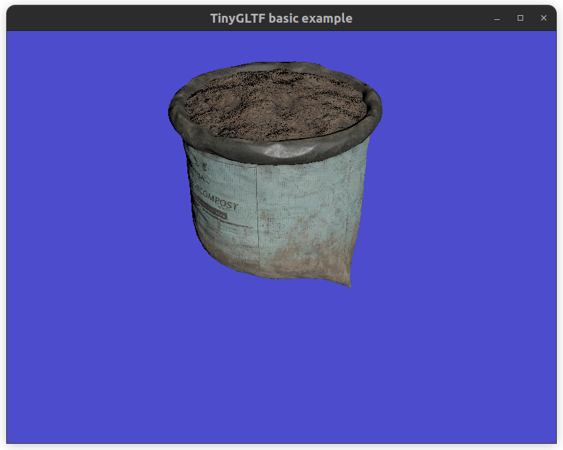

# Project 3E - Physically Based Rendering

Compile the proj3E.cxx file, and run the executable by passing a `.gltf` file as a command line argument.

For the first part ( 8 points), all the work is to be done in the fragment shader. For the additional goals, you may need to modify the other files. 

I would still recommend going through the display loop of the main program.

 
 

## Instructions 

- $p$ is the fragment position
- $V$ is the camera direction ( the direction of outgoing light ) 
- $L$ is the light direction ( the direction of incoming light ) 
- $N$ is the normal of the surface
- $\alpha$ is the roughness factor
- $H$ is the halfway vector, $H = normalize(L+V)$
- $F_0$ is the base reflectivity , $(0.4,0.4,0.4)$ for nonmetals, and the $albedo$ value for metals

For directional light, the amount of light recievced is equal to $f_r(p,N,V,L) * L_i(p,L) * (N \cdot L)$

Where $L_i$ is the light intensity function.

### The Cook-Torrance Bidirectional Reflective Distribution Function $f_r$

$$f_r = \frac{K_d * albedo}{\pi} + K_s * f_\text{cook-torrance-specular}$$

$$f_\text{cook-torrance-specular} = \frac{DFG}{4 * (V \cdot N)(L \cdot N)}$$

In the above, 
- $D = NDF_{TR-GGX}(n, h, \alpha) $
- $G = G_{Smiths-Method}(N,V,L,k)$ 
- $F = F_{Schlick}(H, V, F_0)$
- $K_s = F$
- $K_d = 1 - K_s$ (and 0 for all metals. multiply with (1-metallic))
$$NDF_{TR-GGX}(N, H, \alpha) = \frac{\alpha^2}{\pi((N \cdot H)^2 (\alpha^2 - 1) + 1)^2}$$

$$G_{Smiths-Method}(N,V,L,k)       		 =   G_{SchlickGGX}(N, V, k) * G_{SchlickGGX}(N, L, k)  		$$

$$G_{SchlickGGX}(N, incoming\\_vec, k)       		 =    		\frac{N \cdot incoming\\_vec}    	{(N \cdot incoming\\_vec)(1 - k) + k }$$

For directional light, $$k = \frac{(\alpha + 1)^2}{8}$$

$$F_{Schlick}(H, V, F_0) =     F_0 + (1 - F_0) ( 1 - (H \cdot V))^5$$

It is a bunch of formulas, but all of them are relatively straightforward to implement. 

For the Light Intensity function, we are going to use the light direction **before** normalization. The distance from light source to object is $length(L_{not \hspace{.2em} normalized})$. We then have an initial value (usually around $(30,30,30)$ to $(50,50,50)$ and divide it by the distance obtained.

### gamma correction: (+0.5 points)

Apply gamma correction on the final color. Also, make sure to reverse the correction on the base albedo texture.

### Ambient Occlusion (+0.5 points)

Read the texture from the AO map, and multiply with the albedo texture to get the final albedo color.

### Normal Maps (+2 points)

Recommended: Without Normal Maps, your results won't look as good. Implement normal maps by first implementing the bitangent vector in the vertex shader using the following formula:

$bitangent = normalize( N \times tangent.xyz ) * tangent.w$

Then, create the TBN matrix ( a 3x3 matrix of tangent, bitangent and normal as rows) in the fragment shader. Read the value of the normal texture, normalize the value to be between -1 and 1 (when you read it, it will be between 0 and 1). Then, your new normal vector would be $TBN * normal_{texture}$

### Displacement Maps and Parallax Occlusion Mapping (+3 points)

For some assets, displacement maps are provided. Use them to implement [parallax occlusion mapping](https://learnopengl.com/Advanced-Lighting/Parallax-Mapping)! Also have to modify the config file to load the displacement texture.

### Add 3 more light sources (+2 points)

You have to have the intensity and color information in the config file, and figure out a way to pass the data to the fragment shaders using uniforms ( have to modify the main cxx file).

**Note:** The screenshots folder has helpful outputs showing just specific channel values as color for the default config parameters. 

**Note:** The results of all dot products must be positive!
